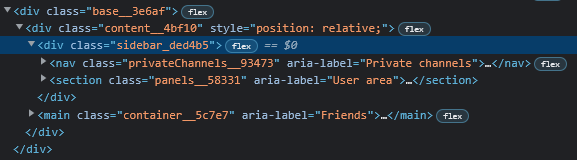
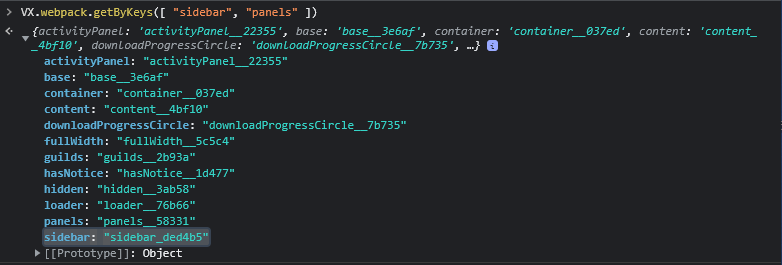

# Developer Tools
Developer tools allows you to see the HTML elements and their styles inside Discord. 

Since Discord uses electron the devtools are the same as in a chromium browser (for the most part), so you can follow the [chrome developer docs](https://developer.chrome.com/docs/devtools/)

## How to get classes
Discord uses a `class_hash` style of classes. 

To get them you can use looking at dom nodes or Webpack (but themes can't use js).

### From DOM Nodes
You can find classes by using inspect elements. This is the easiest way to get classes. Since you can most of the time use the element picker

### From Webpack
With webpack you need to know classes that could be included with it.
* Bad Examples
    * Searching just for `icon` can give over a hundred results
    * Searching just for `sidebar` can give roughly 5
* Good Examples
    * Searching for `icon` and `appIcon` 
    * Searching for `sidebar` and `panels`

### Can they change?
Discord classes can change. 
This usually happens when they change the CSS. 

Most of the time its just one thing of classes that change. 
But theres a chance they could all change

### How to prevent changes
  * They it be `sidebar_hash1` then turn into `sidebar_hash2`. You have update your themes with these classes
      * You can use stuff to help find the classes like webpack
      * Examples
          * Using a comment like `/* sidebar classes -> VX.webpack.getByKeys([ "sidebar", "panels" ]) */`
          * Using [SASS](https://sass-lang.com/) / [PostCSS](https://postcss.org/). With those 2 css supersets you can have class aliases
  * You can also use [attribute selectors](https://developer.mozilla.org/en-US/docs/Web/CSS/Attribute_selectors) to select classes `[class*=sidebar_]`
      * This can cause styles to be in unexpected places so its recommended to not use these by themselves
